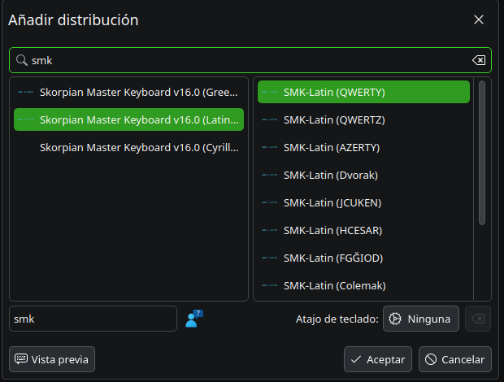
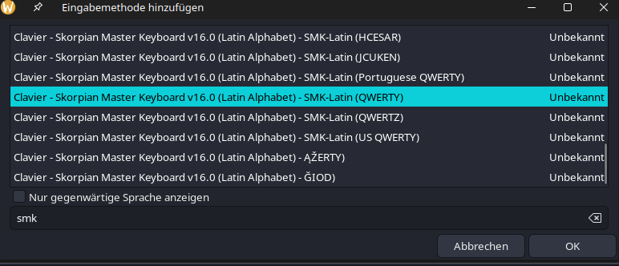
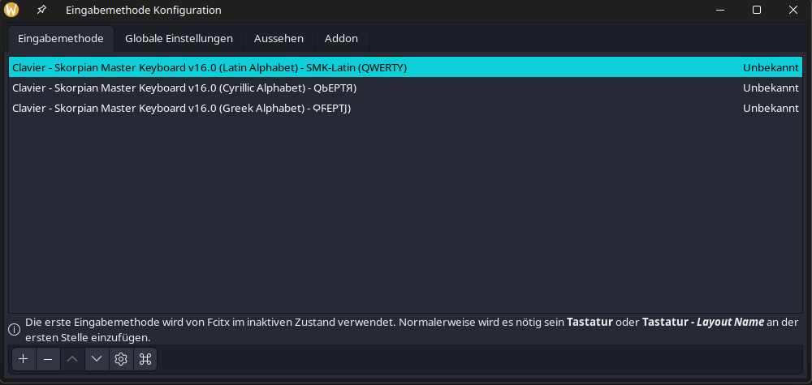

# Installation guide (Skorpian Master Keyboard v16.0+)

## XKB rules generation
This repo's root folder contains a Bash script (named [`xcompose_generator.sh`](../../xcompose_generator.sh)) whose main function is compiling every single one of the `XCompose` rules meant for different writing systems hosted inside `sequences/`. To auto-generate these rules, you have to invoke the previous script **from within the repo's root** (**_after cloning the repo itself_**) like follows:

```bash
$ ./xcompose_generator.sh
```

Once you've run the aforementioned script, you'll have at your disposal all of the repo's `XCompose` rules inside your `$HOME` directory (more precisely within `~/smk_compose/`) as well as the corresponding `.XCompose` file at your `$HOME`'s root (where you'll be able to (un)comment the rules you want to enable/disable).

## Installing the XKB keyboards themselves
If you want to use this repo's keyboards in your own PC, the next step you'll have to take will consist in copying the keyboard layouts from `symbols/smk/layouts/` inside the following folders according to your own preferences:
- `~/.config/xkb/symbols/smk/` (if you decide to make a local install).
- Alognside the rest of your system keyboards (whose exact path can depend on the OS and its concrete distros. In the context of Arch Linux-based distros, the path would be `/usr/share/X11/xkb/symbols/` (which, in this case, would result in `/usr/share/X11/xkb/symbols/smk/`)).

> **[TIP]**: Even though custom keyboards can be added locally at `~/.config/xkb/symbols/smk/`, **it's strongly advised to copy this repo's keyboards inside the previous folder as well as with the other system keyboards** because, aside from being able to visualize these keyboard layouts so long as they are stored with all other system keyboards, there will also exist the possibility that different IMEs such as `fcitx`, `ibus` or `xim` (among many others) **can utilize these keyboards inside applications presenting certain compatibility issues with the rules defined inside your `.XCompose` file**. <br/><br/> This last point is extremely important, mainly due to the fact that the versatility of the SMK keyboard layout line greatly depends on how any given application manages these rules, as well as the presence (or lack thereof) of the SMK keyboard layout line.

After you've transferred each and every XKB keyboard to their corresponding place, you'll also have to copy over the rules contained at `symbols/smk/rules/` to the file `~/.config/xkb/rules/evdev.xml` (at least for the XML rules, if you're doing a local install) and/or `/usr/share/X11/xkb/rules/evdev.xml` + `/usr/share/X11/xkb/rules/evdev.lst` (for a system-wide install) with the objective of being able to choose any SMK keyboard layout variant(s) you need.

> **[TIP]**: Add the XML keyboard definition rules and their respective keyboard variants to `~/.config/xkb/rules/evdev.xml` as well as `/usr/share/X11/xkb/rules/evdev.xml` (**_preferably in the same order for all files_**); all of this alongside the LST rules, whose contents should go, in this case, to `/usr/share/X11/xkb/rules/evdev.lst`. <br/><br> The reason for all of this is similar to the points discussed on the first tip section.

> **[NOTE]**: System updates can sometimes overwrite the system keyboard layout and variant list found at `/usr/share/X11/xkb/`. If this happens, reinstall al SMK keyboard layouts within their corresponding system folders as it has already been described.



## IME Integration
Lastly, after correctly following all the previous steps, [you'll still have to define some environment variables so that any compatible application can load your `.XCompose` file located at your `$HOME` directory's root](https://wiki.archlinux.org/title/Xorg/Keyboard_configuration#Key_combinations). To achieve this, you can borrow the following template as an example and include the next lines inside your terminal profile (`.bash_profile`, `.zprofile`, etc.) or, if you prefer, inside your terminal's config file (if your current session loads that last file from your terminal profile) (`.bashrc`, `.zshrc`, etc.):

```bash
export GTK_IM_MODULE=<ime>
export QT_IM_MODULE=<ime>
export XMODIFIERS="@im=<ime>"   # Required only when you're not using xim as your IME
```

Where `<ime>` is the corresponding IME (`fcitx`, `ibus`, `xim`, etc.).

If you ultimately decide to use an IME other than `xim`, it'll be necessary to take a few last stetps so that your chosen IME can recognize your keyboard layouts and, in turn, access and utilize these `Xcompose` rules designed for SMK keyboard layouts.

### **Fcitx** integration with SMK keyboard layouts (in XKB format) ***[Recommended Option]*** 
Go to Fcitx's config page and add the SMK keyboard layout line to this IME's list:





**🄯 Carlos González Sanz, 2025**
